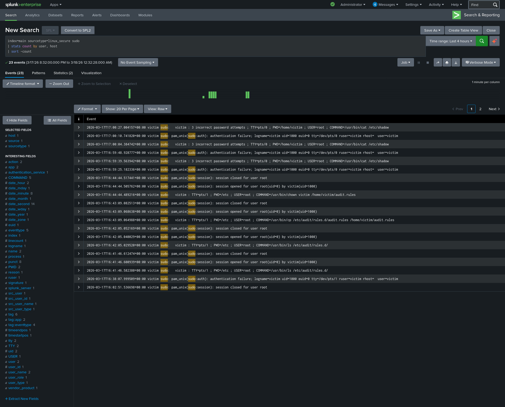

# Scenario 05: Sudo Abuse Detection

**Date:** 2026-03-18
**MITRE ATT&CK:** T1548.003 — Abuse Elevation Control Mechanism: Sudo
**Severity:** High

## Lab Setup
- Attacker: Kali Linux (ATTACKER_IP)
- Victim: Ubuntu Server (VICTIM_IP)
- SIEM: Splunk Enterprise (Free)

## Attack Executed
```bash
# Simulate sudo abuse with wrong password
sudo cat /etc/shadow
sudo cat /etc/shadow
sudo cat /etc/shadow
```

## Detection SPL Query
```splunk
index=main sourcetype=linux_secure sudo
| stats count by user, host
| sort -count
```

## Findings
- Sudo abuse attempts captured in linux_secure logs
- Multiple failed sudo attempts from same user detected

## MITRE ATT&CK Mapping
- Tactic: Privilege Escalation
- Technique: T1548.003 — Sudo Abuse

## Screenshot


## Response Steps
1. Investigate which user is abusing sudo
2. Check if any sudo attempts succeeded
3. Review sudoers file for unauthorized entries
4. Alert system owner of privilege escalation attempt
