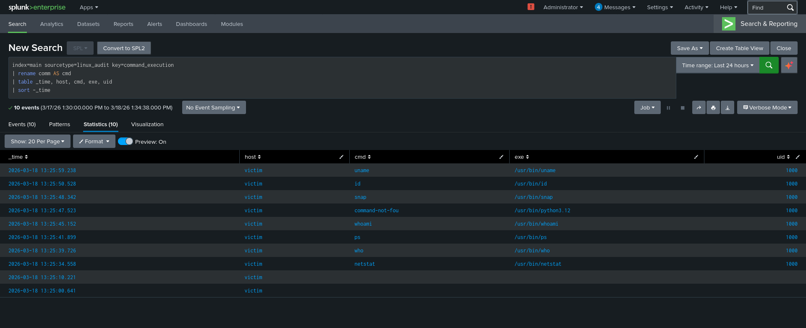

# Scenario 06: Internal Reconnaissance Detection

**Date:** 2026-03-18
**MITRE ATT&CK:** T1082 — System Information Discovery
**Severity:** Medium

## Lab Setup
* Attacker: Kali Linux (ATTACKER_IP)
* Victim: Ubuntu Server (VICTIM_IP)
* SIEM: Splunk Enterprise (Free)

## Attack Executed
```bash
# Attacker performing internal recon after compromise
netstat -tulnp
who
ps aux
whoami
id
uname -a
cat /etc/passwd
```

## Detection SPL Query
```splunk
index=main sourcetype=linux_audit key=command_execution
| rename comm AS cmd
| table _time, host, cmd, exe, uid
| sort -_time
```

## Findings
* 10 events captured showing recon commands
* Auditd execve rule captured all command executions
* Shows attacker behaviour post-compromise

## MITRE ATT&CK Mapping
* Tactic: Discovery
* Technique: T1082 — System Information Discovery
* Technique: T1057 — Process Discovery (ps aux)
* Technique: T1049 — System Network Connections Discovery (netstat)

## Screenshot


## Response Steps
1. Identify which user ran recon commands
2. Check if user account is legitimate
3. Review all commands executed in same session
4. Check for lateral movement attempts after recon
5. Investigate how attacker gained initial access
